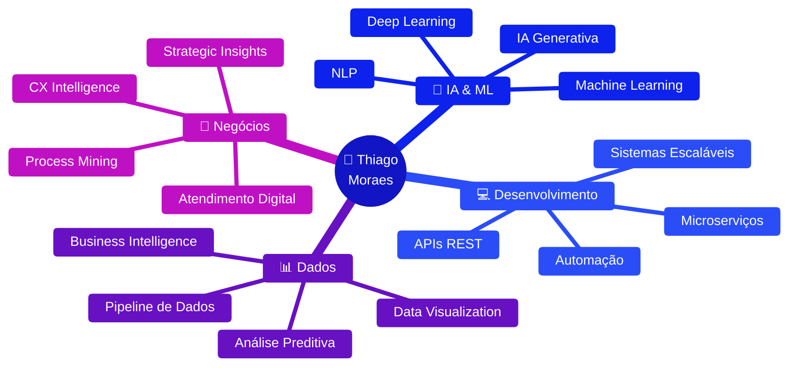

### 🚀 Engenheiro de Sistemas | Especialista em Atendimento Digital

*Transformando dados em insights estratégicos e criando soluções digitais inteligentes*

    
    
    
    

---

## 👨‍💻 Sobre Mim

> Engenheiro de sistemas apaixonado por criar soluções digitais que revolucionam a comunicação entre empresas e clientes.

Com expertise sólida em **Desenvolvimento de Sistemas** e **Análise de Dados**, especializo-me em aplicar tecnologias emergentes de IA para gerar insights valiosos e impulsionar decisões estratégicas.

### 🎯 Foco Atual

Desenvolvimento de soluções baseadas em Machine Learning, aplicações de IA Generativa e especialista em **WhatsApp Business API** para automação de atendimento digital.

## 🛠️ Stack Tecnológico

### Linguagens

Python · Node.js · Java · PHP · C++ · TypeScript

### Frontend & Backend

Angular · React · FastAPI · Spring

### WhatsApp & Mensageria

WhatsApp Business API · Twilio · WebSocket

### IA & Machine Learning

TensorFlow · PyTorch · Scikit-Learn · OpenAI

### Dados & Analytics

Pandas · NumPy · PostgreSQL · MongoDB

### DevOps & Cloud

Docker · Git · Linux · Google Cloud Platform

## 🎯 Áreas de Especialização

```mermaid
%%{init: {'theme':'base', 'themeVariables': { 'primaryColor':'#6366F1','primaryTextColor':'#fff','primaryBorderColor':'#4F46E5','lineColor':'#818CF8','secondaryColor':'#818CF8','tertiaryColor':'#A5B4FC','fontSize':'16px'}}}%%
mindmap
  root((🚀 Thiago<br/>Moraes))
    🤖 IA & ML
      IA Generativa
      Machine Learning
      Deep Learning
      NLP
    💻 Desenvolvimento
      Sistemas Escaláveis
      APIs REST
      Microserviços
      Automação
    📊 Dados
      Pipeline de Dados
      Análise Preditiva
      Business Intelligence
      Data Visualization
    🎯 Negócios
      Atendimento Digital
      CX Intelligence
      Process Mining
      Strategic Insights
```

