  
## 🚀 Engenheiro de Sistemas | Especialista em Atendimento Digital

*Transformando dados em insights estratégicos e criando soluções digitais inteligentes*

---

### 👨‍💻 Sobre Mim

Sou **Thiago Moraes**, engenheiro de sistemas apaixonado por criar soluções digitais que revolucionam a comunicação entre empresas e clientes. Com expertise sólida em **Desenvolvimento de Sistemas** e **Análise de Dados**, especializo-me em aplicar tecnologias emergentes de IA para gerar insights valiosos e impulsionar decisões estratégicas.

**🎯 Foco Atual:** Desenvolvimento de soluções baseadas em Machine Learning e aplicações de IA Generativa

### 🛠️ Stack Tecnológico

<b>💻 Linguagens de Programação</b>

 

<b>🌠Frontend & Backend</b>

 

<b>🤖 IA & Machine Learning</b>

 

<b>📊 Dados & Analytics</b>

 

<b>🔧 DevOps & Ferramentas</b>

 

### 🎯 Áreas de Especialização

```mermaid
mindmap
  root((Thiago Moraes))
    IA & ML
      IA Generativa
      Machine Learning
      Deep Learning
      NLP
    Desenvolvimento
      Sistemas Escaláveis
      APIs REST
      Microserviços
      Automação
    Dados
      Pipeline de Dados
      Análise Preditiva
      Business Intelligence
      Data Visualization
    Negócios
      Atendimento Digital
      CX Intelligence
      Process Mining
      Strategic Insights
```

### 🚀 Projetos em Destaque

- 🤖 **Chatbots Inteligentes** - Soluções de atendimento automatizado com IA
- 📊 **Pipelines de ML** - Sistemas de processamento e análise de dados em tempo real
- 🔍 **Analytics Dashboards** - Painéis interativos para Business Intelligence
- 🎯 **CX Intelligence** - Análise preditiva de experiência do cliente

### 📫 Vamos Conversar?

    
    
    

---

**💡 "A tecnologia é melhor quando aproxima as pessoas"** - *Matt Mullenweg*

*Sempre aberto para colaborações em projetos inovadores de IA e análise de dados!*

